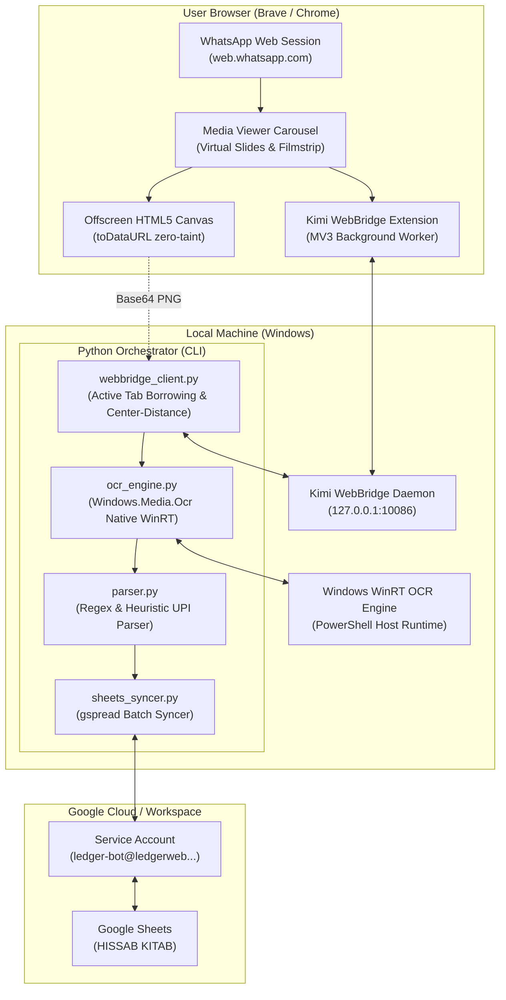
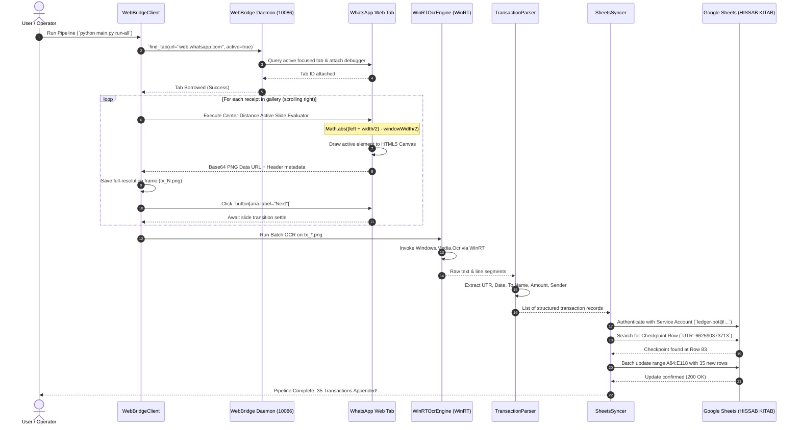

# WhatsApp Web Session to Google Sheets Automation Bot

Automated end-to-end extraction pipeline that connects directly to an active, authenticated **WhatsApp Web** browser session via **Kimi WebBridge**, iterates through media viewer transaction receipts, extracts structured payment details using **Windows WinRT Native OCR**, and synchronizes records directly into **Google Sheets** using a dedicated Google Service Account (`ledger-bot@ledgerweb.iam.gserviceaccount.com`).

---

## 📐 System Architecture Diagram



---

## 🔄 End-to-End Sequence Flow



---

## 💡 How It Works & Key Engineering Solutions

### 1. Active Tab Borrowing (Zero Re-authentication)
Instead of launching headless Chromium and requiring a fresh QR code login, the bot communicates with the **Kimi WebBridge daemon** (`127.0.0.1:10086`) and queries the user's running browser via the extension. Calling `find_tab` with `active: true` borrows the tab already in foreground focus, inheriting cookies, session storage, IndexedDB, and state.

### 2. Center-Distance Carousel Algorithm
In WhatsApp Web's media viewer, slides use virtualized horizontal transitions (`translateX`). When querying the DOM, previous and preloaded slides remain attached, causing naive selectors (`img[src^="blob:"]` or size filters) to capture offscreen or phantom slides.

To resolve this, we calculate the horizontal distance from the viewport's center line:

$$\Delta = \left| \left( \text{rect.left} + \frac{\text{rect.width}}{2} \right) - \frac{\text{window.innerWidth}}{2} \right|$$

Sorting all on-screen candidate images by minimum $\Delta$ mathematically guarantees identification of the true visible slide, regardless of whether it is a portrait receipt (505×1280) or landscape crop (896×261).

### 3. Zero-Taint Canvas Frame Capture
Traditional viewport screenshotting introduces OS scaling factors and window borders. Because blob URLs (`blob:https://web.whatsapp.com/...`) belong to the current origin, the bot draws the image onto an in-memory HTML5 `<canvas>` sized to `img.naturalWidth` × `img.naturalHeight` and extracts `canvas.toDataURL('image/png')`. This extracts 100% pixel-perfect, lossless PNG bytes at native mobile resolution.

### 4. Native Windows WinRT OCR (`Windows.Media.Ocr`)
Rather than depending on heavy external binaries like Tesseract or cloud APIs, the bot invokes the built-in Windows 10/11 WinRT OCR engine through a lightweight PowerShell bridge.
- **Speed:** ~150–200 ms per image (~5 seconds for 72 full-page receipts).
- **Offline:** Runs locally with zero telemetry or API costs.
- **Accuracy:** High fidelity recognition for English and regional banking numerals.

### 5. Automated Google Sheets Synchronization
Using the service account `ledger-bot@ledgerweb.iam.gserviceaccount.com`:
- Connects to Google Sheets via `gspread` and `google-auth`.
- Inspects the spreadsheet `HISSAB KITAB` (`1nhGx50fEs2-lLhMsZbbjJuR8lpIBieIF88kPWxWxv_c`).
- Finds the exact checkpoint row matching UTR `662590373713` (Row 83).
- Batch inserts subsequent transactions starting at Row 84 across columns:
  - **Column A:** `Amount`
  - **Column B:** `Date`
  - **Column C:** `To Banking Name`
  - **Column D:** `Reference Name` (Customer / Sub-person)
  - **Column E:** `UTR No`

---

## 📂 Project Structure

```
├── config.py             # Global configuration, endpoints, IDs, and paths
├── webbridge_client.py   # WebBridge driver, tab borrowing, carousel navigation, canvas extractor
├── ocr_engine.py         # Native Windows WinRT OCR engine wrapper
├── parser.py             # UPI & Google Pay receipt heuristic parser
├── sheets_syncer.py      # Google Sheets API service account synchronizer
├── main.py               # CLI orchestrator supporting modular and end-to-end runs
├── transactions.md       # Extracted markdown transaction report
├── requirements.txt      # Python dependencies
└── .gitignore            # Excludes secrets, credentials, and raw images
```

---

## 🚀 Setup & Usage Guide

### Prerequisites
1. **Windows 10 / 11** with PowerShell 5.1+.
2. **Python 3.10+**.
3. **Kimi WebBridge Daemon & Browser Extension** installed in Chrome/Brave.
4. **Google Cloud Service Account JSON key** with Editor access to the target Google Sheet.

### Installation
```bash
git clone https://github.com/roshan-pixel/WhatsApp-Web-session----sheets-using----service-Bot.git
cd WhatsApp-Web-session----sheets-using----service-Bot
pip install -r requirements.txt
```

### CLI Commands

#### 1. End-to-End Execution (Scrape + OCR + Parse + Sync)
```bash
python main.py run-all --checkpoint-utr 662590373713
```

#### 2. Individual Pipeline Stages
```bash
# Step 1: Scrape active WhatsApp gallery to the right
python main.py scrape --output-dir data/tx_images

# Step 2: Run native Windows WinRT OCR on all saved images
python main.py ocr --images-dir data/tx_images

# Step 3: Parse extracted text into structured transaction objects
python main.py parse

# Step 4: Synchronize parsed records into Google Sheets after checkpoint UTR
python main.py sync --checkpoint-utr 662590373713
```

---

## 📊 Output Schema

Standard output format (`UTR No // Date // To Banking Name // Amount`):

```text
662702685130 // 18 Sept 2026, 2:39 pm // DSR 7 WELLNESS CENTRE // ₹6,888.00
662782664072 // 18 Sept 2026, 2:47 pm // DSR 7 WELLNESS CENTRE // ₹8,850.88
662720675604 // 18 Sept 2026, 2:49 pm // DSR 7 WELLNESS CENTRE // ₹749.00
662738666166 // 18 Sept 2026, 2:51 pm // DSR 7 WELLNESS CENTRE // ₹16,989.56
...
626861461557 // 25 Sept 2026, 1:49 pm // DSR 7 WELLNESS CENTRE // ₹1,244.00
```

---

## 🔒 Security & Privacy
- **Credentials Hygiene:** Never commit Service Account JSON keys or sensitive personal chats to source control. The `.gitignore` is pre-configured to block `*.json` credentials and image artifacts.
- **Read-Only Verification:** Gallery scraping uses non-destructive synthetic event clicks on the user's active session without altering chat history.
